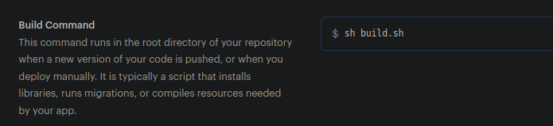
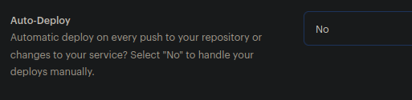

## Résumé

    Ce projet à été réalisé dans le cabdre du parcours 
    "Développeur d'application - Python" d'OpenClassrooms.

Site web d'Orange County Lettings

## Développement local

### Prérequis

- Compte GitHub avec accès en lecture à ce repository
- Git CLI
- SQLite3 CLI
- Interpréteur Python, version 3.6 ou supérieure

Dans le reste de la documentation sur le développement local, il est supposé que la commande `python` de votre OS shell exécute l'interpréteur Python ci-dessus (à moins qu'un environnement virtuel ne soit activé).

### macOS / Linux

#### Cloner le repository

- `cd /path/to/put/project/in`
- `git clone https://github.com/geoffrey-ll/P13_GL_Open_County_Lettings.git`

#### Créer l'environnement virtuel

- `cd /path/to/P13_GL_Open_County_Lettings`
- `python -m venv venv`
- `apt-get install python3-venv` (Si l'étape précédente comporte des erreurs avec un paquet non trouvé sur Ubuntu)
- Activer l'environnement `source venv/bin/activate`
- Confirmer que la commande `python` exécute l'interpréteur Python dans l'environnement virtuel
`which python`
- Confirmer que la version de l'interpréteur Python est la version 3.6 ou supérieure `python --version`
- Confirmer que la commande `pip` exécute l'exécutable pip dans l'environnement virtuel, `which pip`
- Pour désactiver l'environnement, `deactivate`

#### Créer les variables d'environnements local

- `cd /path/to/P13_GL_Open_County_Lettings`
- `nano .env`
- Copier et coller ceci :
  ```
  SECRET_KEY="<your_secret_key>"
  DEBUG=True
  DATABASE_ENGINE=django.db.backends.sqlite3
  DATABASE_NAME=oc-lettings-site.sqlite3
   ```
- Enregistrer avec `Ctrl + X` puis `o` puis `Enter`

#### Exécuter le site

- `cd /path/to/P13_GL_Open_County_Lettings`
- `source venv/bin/activate`
- `pip install --requirement requirements.txt`
- `python manage.py runserver`
- Aller sur `http://localhost:8000` dans un navigateur.
- Confirmer que le site fonctionne et qu'il est possible de naviguer (vous devriez voir plusieurs profils et locations).

#### Linting

- `cd /path/to/P13_GL_Open_County_Lettings`
- `source venv/bin/activate`
- `flake8`

#### Tests unitaires

- `cd /path/to/P13_GL_Open_County_Lettings`
- `source venv/bin/activate`
- `python manage.py test`

#### Base de données

- `cd /path/to/P13_GL_Open_County_Lettings`
- Ouvrir une session shell `sqlite3`
- Se connecter à la base de données `.open oc-lettings-site.sqlite3`
- Afficher les tables dans la base de données `.tables`
- Afficher les colonnes dans le tableau des profils, `pragma table_info(profiles_profile);`
- Lancer une requête sur la table des profils, `select user_id, favorite_city from
  profiles_profile where favorite_city like 'B%';`
- `.quit` pour quitter

#### Panel d'administration

- Aller sur `http://localhost:8000/admin`
- Connectez-vous avec l'utilisateur `admin`, mot de passe `Abc1234!`

### Windows

Utilisation de PowerShell, comme ci-dessus sauf :

- Pour activer l'environnement virtuel, `.\venv\Scripts\Activate.ps1` 
- Remplacer `which <my-command>` par `(Get-Command <my-command>).Path`

### Image docker

Pour récupérer la dernière version de l'image :\
`docker pull goclusername/p13_open_county_lettings_images:latest`

Pour démarrer l'image\
`docker run --name cont --env-file .env --publish 8000:8000 -t goclusername/p13_open_county_lettings_images`\
Le fichier .env doit contenir :

```
SECRET_KEY="<your_secret_key>"
DEBUG=True
DATABASE_ENGINE=django.db.backends.sqlite3
DATABASE_NAME=oc-lettings-site.sqlite3
```

## Déploiement (via une pipeline CI/CD)

### Fonctionnement de la pipeline CI/CD

#### Un push depuis une branche (hors branche master)

- Déclenche les tests `python3 manage.py test` et `flake8 --config setup.cfg`

#### Un push depuis la branche master

- Déclenche les tests `python3 manage.py test` et `flake8 --config setup.cfg`
- Si les tests réussissent :
  - Déclenche la création d'une image Docker
  - Push l'image créée sur Hub-docker
- Si la création de l'image et son push réussissent :
  - Déclenche le déploiement sur Render

### Prérequis

- Compte Gitlab (pour exécuter la pipeline en .gitlab-ci.yml)
- Compte Hub-docker
- Compte Sentry
- Compte Render
- docker

### Gitlab - Ajout des variables d'environnements

- Depuis votre projet gitlab, allez dans `settings`-->`CI/CD`-->`Variables`
- Ajouter les variables d'environnements suivants :
  ```
  DATABASE_ENGINE		django.db.backends.sqlite3
  DATABASE_NAME		oc-lettings-site.sqlite3
  DEBUG			True
  HUB_DOCKER_TOKEN	<your_hub_docker_token>
  HUB_DOCKER_USERNAME	<your_hub_docker_username>
  IMAGE_NAME		<your_image_name>
  RENDER_API_KEY		<your_render_api_key>
  RENDER_SERVICE_URL	https://api.render.com/v1/services/<your_id_render>/deploys
  SECRET_KEY		<your_secret_key>
  ```
  en décochant `Protect variable` (voir exemple ci-dessous) \
  

### Hub-docker - Création d'un token

- Depuis votre compte hub-docker, allez dans `Account Settings`-->`Security`
- Créer un nouveau token avec `New Access Token` avec la permission d'écriture (voir exemple ci-dessous) \


### Sentry - Nouveau projet & DSN

#### Créer un nouveau projet

- Depuis votre compte Sentry, allez dans `Projects`-->`Create Project`
- Choisir la platform `DJANGO` et un `project name` puis `Create Project`
- Le DSN sera affiché

#### Accéder au DSN d'un projet existant

- Depuis votre compte Sentry, allez dans \
  `Settings`-->`Projects`-->`<your_project_name>`-->`Client keys (DSN)`

### Render - API Key & Web Service & Variables d'environnements

#### API Key Render

- Depuis votre compte Render, allez dans \
  `Account Settings`-->`API Keys`-->`Create API Key`-->`<your-api-name>` \
  


#### Création d'un Web Service

- Depuis votre compte Render, allez dans `New +`-->`Web Service`
- Connecter Render au repo Gitlab
- Dans les configurations :
  - `Name` --> `<your-site-name>` \
    
  - `Region` --> `Frankfurt (EU Central)` \
    
  - `Branch` --> `master` \
    
  - `Runtime` --> `Python 3` \
    
  - `Build Command` --> `sh build.sh` \
    
  - `Start Command` --> `gunicorn oc_lettings_site.wsgi:application` \
    
  - `Advanced` --> `Add Environment Variable` \
    Voir [variables d'environnements Render nécessaires](#env_var_render) \
    
  - `Advanced` --> `Auto-Deploy` --> `No` \
    

#### Ajout de variable d'environnement depuis un Web Service existant

- Depuis le web service de votre compte Render, allez dans `Environment`-->`Add Environment Variable`

#### Variables d'environnements Render nécessaires <a name="env_var_render"></a>

  ```
  DATABASE_ENGINE		django.db.backends.sqlite3
  DATABASE_NAME		oc-lettings-site.sqlite3
  DEBUG			False
  HOSTS_PROD		<your-site-name>.onrender.com
  PYTHON_VERSION		3.10.6
  SECRET_KEY		<your-secret-key-generated>
  SENTRY_DSN		<your-dsn-sentry>
  ```
